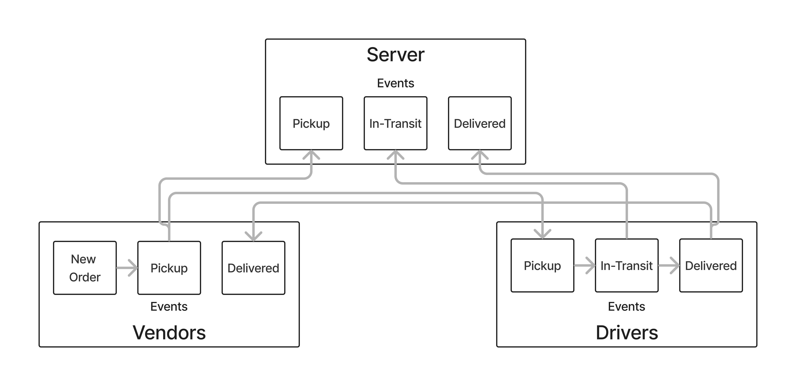

# LAB - Class 11

## Project: Code Academy Parcel Service (CAPS)

### Authors: Branden Ge

### Problem Domain

This lab demonstrates how to implement an Express API complete with authentication and authorization functionality, restricting access to routes that manipulate a database with music and movie information. It also features a comprehensive automated test suite.

- [GitHub Repo](https://github.com/brandenge/code-academy-parcel-service)

### Setup

`.env` Environments variables set as shown in the `.env.sample`

- `PORT`

#### Running the app

- `npm start` or `nodemon` (if you have nodemon) to start the application.

#### Features / Routes

#### UML Diagram

Diagram created with [Figma](https://www.figma.com/)

#### Credits: [Demo code from Ryan Gallaway at Code Fellows](https://github.com/codefellows/seattle-code-javascript-401d48/tree/main/class-11/inclass-demo)
